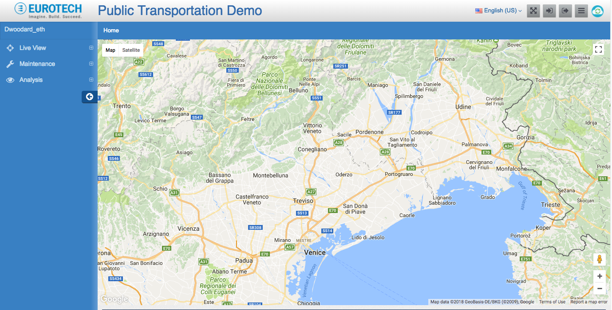

#  PCN Transportation Demo

The PCN Transportation Demo is a ReactJS based application intended to provide
a visual interface for [Eurotech's Optical Passenger Counter](https://www.eurotech.com/en/products/PCN-1001) solution for transportation
based applications. This repository also contains simulators that allow users
to try the Demo with virtualized hardware. The best place to start is by reading
the [official documentation](docs#Overview).

