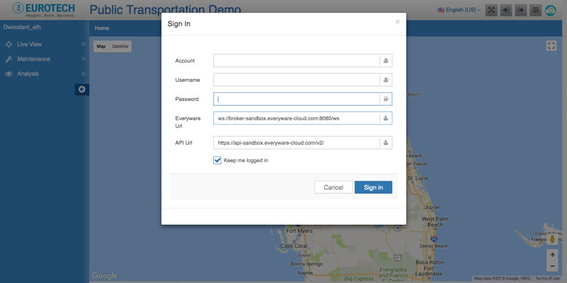
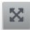
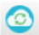

# PCN Transportation Dashboard

| [Overview](README.md) | PCN Transportation Dashboard | [Hosted PCN GPS Simulator](web-pcn-sim.md) | [ESF PCN GPS Simulator](esf-pcn-gps-sim.md) |
|---|---|---|---|

The PCN Transportation Dashboard provides a visual view of PCN based applications
associated with your Eurotech Everyware Cloud account. The dashboard is intended
to provide information on vehicle telemetry data (location, speed, etc.) and
passenger population information (passengers in, passengers out, total
passengers).

**Table of Contents**
- [Credentials](#credentials)
- [Top Navigation](#top-navigation)
- [Left Navigation Live-View](#left-navigation-live-view)
- [Left Navigation Maintenance](#left-navigation-maintenance)
- [Left Navigation Analysis](#left-navigation-analysis)

## Credentials
When first launching the web page, the following login dialog will be presented:

The fields in the dialog are defined as:

| Field | Description |
|---|---|
| **Account** | The Everyware Cloud account to which the dashboard will connect. |
| **Username** | The Everyware Cloud username with which the dashboard will authenticate. The user should have proper permissions to both access the APIs as well as connect to the MQTT broker. |
| **Password** | The password associated with the Everyware Cloud username. |
| **Everyware URL** | The websocket based address for the Everyware Cloud MQTT broker. The default value of ws://broker-sandbox.everyware-cloud.com:8080/ws should be used for most scenarios. |
| **API Url** | The URL of the Everyware Cloud REST APIs. The default value of https://api-sandbox.everyware-cloud.com/v2/ should be used for most scenarios. |
| **Keep me logged in** | When checked, this value will store credentials within the browser to prevent having to login multiple times. |

## Top Navigation
The navigation buttons in the top right portion of the screen support these
functions:

| Icon | Description |
|---|---|
|  | This Button enables full screen mode. |
|  | This button presents the credentials dialog again. |
|  | This button logs the current user out of the dashboard. **This feature is currently not functional**. |
|  | This button toggles the navigation elements on the left side of the web page. |
|  | This icon shows the current status of the connection with Everyware Cloud. |
|  | **This feature is currently not functional**. Only English is supported at this time. |

## Left Navigation Live-View

The Live View section shows all gateways or simulators currently connected to the associated account which have an application ID registered that matches one of the Application Identifiers listed in the dashboard’s [configuration section](#configuration).

The dashboard application may take some time to process the devices associated
with the account. While the devices are being processed, the user may see a
spinning icon. Once this icon disappears, the user can select the checkbox
associated with the device to view it on the map.

## Left Navigation Maintenance
### Configuration
The configuration page allows the user to dynamically change certain settings
of the web application. Below is a listing of available settings:

| Field | Description |
|---|---|
| **Web Portal Title** | Title for the web application. |
| **Speed Units** | Units to be used when displaying vehicle speed information (mph or kph). |
| **Trail Size** | The number of GPS data points to use when displaying a trace of the vehicles route on the map. |
| **Application Identifiers** | These values correlate to a device's application identifier that is sent as part of the birth certificate when a device connects to Everyware Cloud. This value is set in either an ESF application via the [CloudService](http://download.eclipse.org/kura/docs/api/3.0.0/apidocs/org/eclipse/kura/cloud/CloudService.html) or when creating a device with the [device API](https://api-sandbox.everyware-cloud.com/docs/resource_Devices.html#path__devices.html). Application Identifiers can be edited via the text box or added/removed using the plus/minus buttons . The **Save Application Identifiers** button must be clicked in order to apply any changes from this section.
| **Passenger Count Topics** | These are the topics the web application subscribes to in order to gather passenger count information. For example, a device may relay passenger "In" information on the topic: `{account}/{client_id}/PCNPublisher/Bus/AbsoluteIn`    Passenger Count Topics can be edited via the text box or added/removed using the plus/minus buttons . The **Save Topics** button must be clicked in order to apply any changes from this section. |
| **Location Topic** | This is the topic the web application subscribes to in order to gather vehicle GPS information. The Location Topic can be edited via the text box. |
| **WS Broker URL** | The websocket based address for the Everyware Cloud MQTT broker. The default value of ws://broker-sandbox.everyware-cloud.com:8080/ws should be used for most scenarios. The **Reconnect to Everyware Cloud** button must be clicked to apply changes to this section. |
| **API URL** | The URL of the Everyware Cloud REST APIs. The default value of https://api-sandbox.everyware-cloud.com/v2/ should be used for most scenarios. The **Reconnect to Everyware Cloud** button must be clicked to apply changes to this section. |

### Geofence
Not implemented at this time.
### Bus
Not implemented at this time.
### Route
Not implemented at this time.
### Itinerary
Not implemented at this time.
### Drivers
Not implemented at this time.
### Terminal
Not implemented at this time.

## Left Navigation Analysis
### Need more buses
Not implemented at this time.
### Late arrival
Not implemented at this time.
### Bus empty
Not implemented at this time.
### External Data
Not implemented at this time.
