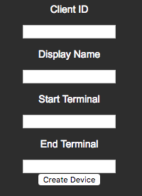
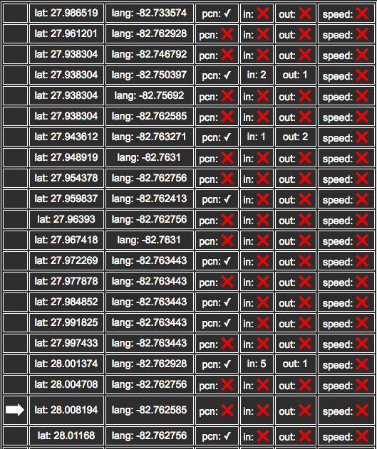

# Hosted PCN GPS Simulator

| [Overview](README.md) | [PCN Transportation Dashboard](dashboard.md) | Hosted PCN GPS Simulator | [ESF PCN GPS Simulator](esf-pcn-gps-sim.md) |
|---|---|---|---|

The PCN GPS Simulator web application is intended to emulate physical PCN and
gateway devices. The simulator leverages the [Everyware Cloud APIs](https://api-sandbox.everyware-cloud.com/docs/index.html) to create virtual
devices when necessary and publish data to Everyware Cloud.

**Table of Contents**
- [Credentials](#credentials)
- [Devices](#devices)
- [GPS Data](#gps-data)

## Credentials
When first launching the web page, the following login dialog will be presented:


The fields in the dialog are defined as:

| Field | Description |
|---|---|
| **Account** | The Everyware Cloud account to which the dashboard will connect. |
| **User** | The Everyware Cloud username with which the dashboard will authenticate. The user should have proper permissions to both access the APIs as well as connect to the MQTT broker. |
| **Password** | The password associated with the Everyware Cloud username. |

## Devices
The Devices section of the application attempts to find all gateways or
simulators currently connected to the associated account which have an
application ID of "PCNPublisher". If devices are found, the user may select
one of the devices from the dropdown list to use with the application. If no
devices were found, or if the user chooses  to create a different device, the
**Create a new device** button will allow for the creation of a new virtual
device.

### Create a New Device
This section may be skipped if the user decides to use an existing device
from the populated dropdown list. If the **Create a new device** button is
clicked, the user will be presented with the following form:



The fields in the dialog are defined as:

| Field | Description |
|---|---|
| **Client ID** | The MQTT client ID used for the virtual device. This value should be unique from any other client IDs associated with the Everyware Cloud account. |
| **Display Name** | The display name to be used for the virtual device. |
| **Start Terminal** | The name for the starting point of the virtual device's route. This is an optional parameter and may be left blank. |
| **End Terminal** | The name for the ending point of the virtual device's route. This is an optional parameter and may be left blank. |

Once the form is completed, click the **Create Device** button to generate the
virtual device. If created successfully, the new device will be displayed and
selected in the dropdown list. Optionally, the user may click the
**Hide create device form** to hide the form for creating a virtual device.

## GPS Data
The simulator uses a comma separated text file to generate the simulated PCN
and GPS information. The format of the line is:

```
{latitude},{longitude},{pcn},{in},{out},{speed}
```

Each line of the file is parsed and the resulting data published to Everyware
Cloud. Each line of the file may contain the entries indicated in the below
table. Required and optional entries are noted as such within the table.

| Field | Description |
|---|---|
| **latitude** | This is a required field for the latitude coordinate of the simulated vehicle. |
| **longitude** | This is a required field for the longitude coordinate of the simulated vehicle. |
| **pcn** | This is an optional field to indicate a scheduled stop of the vehicle. For example, this may be used to indicate a bus station where passengers enter or exit the bus. While this field is optional, each simulation file should have a few lines with this setting in order to generate interesting data in the dashboard. |
| **paxin** | This is an optional field to indicate passengers entering the vehicle. This value should only be used when the **pcn** value is also present. If the **pcn** value is present and **paxin** is ommitted, the simulator will use a randomly generated value for the **paxin** count. |
| **paxout** | This is an optional field to indicate passengers exiting the vehicle. This value should only be used when the **pcn** value is also present. If the **pcn** value is present and **paxout** is ommitted, the simulator will use a randomly generated value for the **paxout** count. |
| **speed** | This is an optional value to indicate the vehicles speed. |

[This website](https://www.findlatitudeandlongitude.com/click-lat-lng-list/#.Wr7G39PwZTY)
provides a free utility for generating GPS coordinates. Below is an example file
that may be used with the simulator.

```
27.986519,-82.733574,pcn
27.961201,-82.762928
27.938304,-82.746792
27.938304,-82.750397,pcn,paxin=2,paxout=1
27.938304,-82.75692
27.938304,-82.762585
27.943612,-82.763271,pcn,paxin=1,paxout=2
27.948919,-82.7631
27.954378,-82.762756
27.959837,-82.762413,pcn
27.96393,-82.762756
27.967418,-82.7631
27.972269,-82.763443,pcn
27.977878,-82.763443
27.984852,-82.763443,pcn
27.991825,-82.763443,pcn
27.997433,-82.763443
28.001374,-82.762928,pcn,paxin=5,paxout=1
28.004708,-82.762756
28.008194,-82.762585
28.01168,-82.762756,pcn
28.013347,-82.759151
28.016681,-82.75898,pcn
28.019712,-82.75898
28.019257,-82.754345,pcn
28.019105,-82.750053
28.015771,-82.747135
28.012437,-82.746277,pcn
28.009406,-82.744217
28.006072,-82.742157,pcn
28.001525,-82.742157
27.996372,-82.742157
27.991218,-82.742157,pcn
27.989854,-82.747307
27.989399,-82.752113,pcn
27.989551,-82.75486
27.992886,-82.755032,pcn
27.994098,-82.751083,pcn
```

The contents of the user's text file, or the above example, may be pasted into
the simulator's text box. Once pasted, the below options are available for
controlling the simulation.

| Field | Description |
|---|---|
| **Time Interval in seconds** | This time, in seconds, is the length of time between the reading of each line of the simulation file. |
| **Bus max passenger capacity** | The maximum number of people simulated to be on the vehicle at any time. |
| **Bus initial passengers** | The number of of people initially on the vehicle when the simulation starts. |
| **Bus max variation in passengers** | When allowing the simulator to randomly generate values for the in/out counts, this values dictates the maximum deviation in these counts. |

Once the above values are set, the user may click the **Start sending messages**
button. The simulator will not begin publishing messages to Everyware Cloud. A
table, similar to the one below, is created as a visual indicator of published
messages.



To stop sending messages, click the **Stop sending messages** button.
